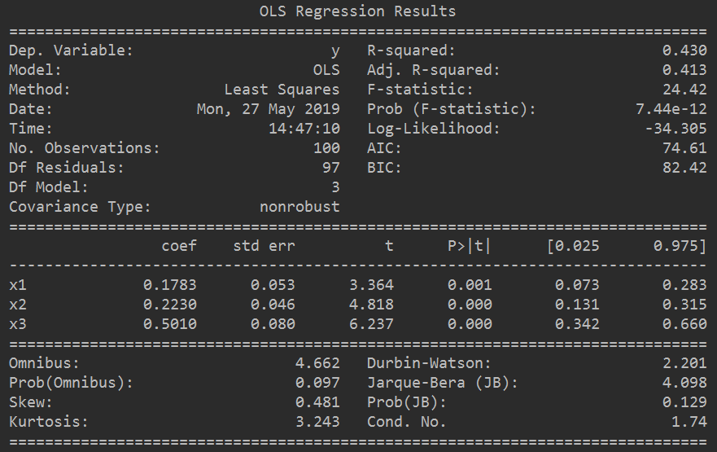
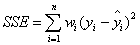
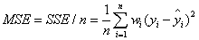
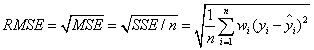
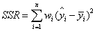
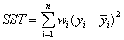
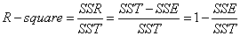

### 1、OLS说明
最小二乘法：

&emsp;给定序列`X( x1, x2, ..., xn )`, `y`, 估计一个向量`A（a0, a1, a2, ...）`。令
`y' = a0 + a1 * x1 + a2 * x2 + ... + an * xn`，使得`(y' - y) ^ 2`最小，计算A。

**Summary示例：**

**参数说明：**

参数名称|值|说明
:-|:-|:-
`Dep. Variable`|Rent|输出Y变量的名称Rent
`Model`|OLS|使用的参数确定的模型OLS
`Method`|Least Squares|使用最小二乘法确定参数
`Date`|Mon, 27 May 2019|日期
`Time`|14:47:10|时间
`No. Observations`|100|样本数目
`Df Residuals`|97|残差的自由度（等于观测数`No. Observations` - 参数数目`Df Model + 1(常量参数)`）  残差：指实际观察值与估计值（拟合值）之间的差
`Df Model`|3|模型参数个数（不包含常量参数），对应于coef中的行数
`Covariance Type`|nonrobust|协方差类型
`R-squared`|0.430|可决系数，说明估计的准确性 “可决系数”是通过数据的变化来表征一个拟合的好坏。由上面的表达式可以知道“确定系数”的正常取值范围为[0,1]，越接近1，表明方程的变量对y的解释能力越强，这个模型对数据拟合的也较好
`Adj. R-squared`|0.413|修正方
`F-statistic`|24.42|衡量契合度的重要程度。模型的均方误差除以残差的均方误差
`Prob (F-statistic)`|7.44e-12|
`Log-Likelihood`|-34.305|
`AIC`|74.61|
`BIC`|82.42|

### 2、统计学相关参数：

**SSE**（和方差、误差平方和）：The sum of squares due to error

**MES**（均方差、方差）：Mean squared error

**RMSE**（均方根、标准差）：Root mean squared error

**R-square**（确定系数）：Coefficient of determination

**Adjusted R-square**：Degree-of-freedom adjusted Coefficient of determination

##### 1. SSE（和方差）
&emsp;该统计参数计算的是拟合数据和原始数据对应点的误差的平方和，计算公式如下：

&emsp;SSE越接近于0，说明模型选择和拟合更好，数据预测也越成功。MSE和RMSE因为和SSE是同出一宗，所以效果一样。

##### 2. MSE（均方差）
&emsp;该统计参数是预测数据和原始数据对应点误差的平方和的均值，也就是SSE/n，和SSE没有太大的区别，计算公式如下：

##### 3. RMSE（均方根）
&emsp;该统计参数，也叫回归系统的拟合标准差，是MSE的平方根，计算公式如下：

&emsp;在这之前，我们所有的误差参数都是基于预测值（y_hat）和原始值（y）之间的误差（即点对点）。从下面开始是所有的误差都是相对原始数据平均值（y_ba）而展开的（即点对全）。

##### 4. R-square（确定系数）
&emsp;在讲确定系数之前，我们需要介绍另外两个参数SSR和SST，因为确定系数就是由它们两个决定的。
 1. SSR：Sum of squares of the regression，即预测数据与原始数据均值之差的平方和，公式如下：

 2. SST：Total sum of squares，即原始数据和均值之差的平方和，公式如下：

&emsp;你会发现，SST = SSE + SSR,而我们的“确定系数”是定义为SSR和SST的比值，故

&emsp;“确定系数”是通过数据的变化来表征一个拟合的好坏。由上面的表达式可以知道“确定系数”的正常取值范围为[0, 1]，越接近1，表明方程的变量对y的解释能力越强，这个模型对数据的拟合也较好。
