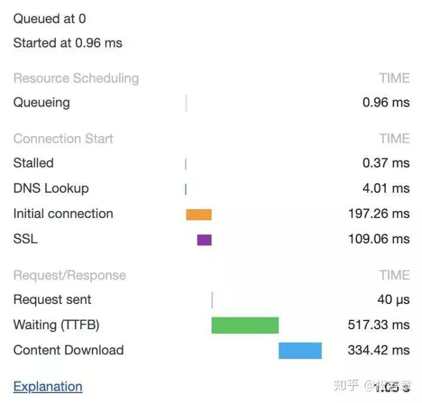
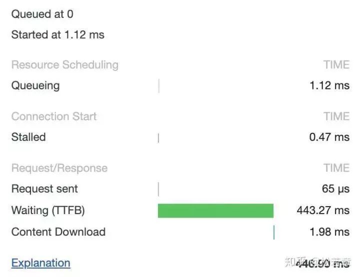
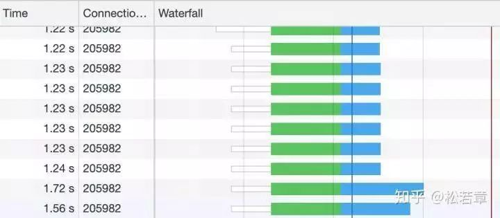

要搞懂这个问题，我们需要先解决下面五个问题：

1. 现代浏览器在与服务器建立了一个TCP连接后是否会在一个HTTP请求完成后断开？什么情况下会断开？

2. 一个TCP连接可以对应几个HTTP请求？

3. 一个TCP连接中HTTP请求发送可以一起发送么（比如一起发三个请求，再三响应一起接收）？

4. 为什么有的时候刷新页面不需要重新建立SSL连接？

5. 浏览器对同一Host建立TCP连接的数量有没有限制？

#### 问题一：现代浏览器在与服务器建立了一个TCP连接后是否会在一个HTTP请求完成后断开？什么情况下会断开？

&emsp;在HTTP/1.0中，一个服务器在发送完一个HTTP响应后，会断开TCP连接。但这样每次请求都会重新建立和断开TCP连接，代价过大。

&emsp;所以虽然标准中没有设定，某些服务器对Connection:keep-alive的Header进行了支持。意思是说，完成这个HTTP请求之后，不要断开HTTP请求使用的TCP连接。这样的好处是可以被重新使用，之后发送HTTP请求的时候不需要重新建立TCP连接，以及如果维持连接，那么SSL的开销也可以避免，两张图片是我短时间内两次访问`https://www.github.com`的时间统计：

&emsp;头一次访问，有初始化连接和SSL开销

&emsp;初始化连接和SSL开销消失了，说明使用的是同一个TCP连接。

**持久连接：**

&emsp;既然维持TCP连接好处这么多，HTTP/1.1就把Connection头写进标准，并且默认开启持久连接，除非请求中写明Connection:close，那么浏览器和服务器之间是会维持一段时间的TCP连接，不会一个请求结束就断掉。

&emsp;所以第一个问题的答案是：默认情况下建立TCP连接不会断开，只有在请求报头中声明Connection:close才会在请求完成后关闭连接。

#### 问题二：一个TCP连接可以对应几个HTTP请求？
&emsp;了解了第一个问题之后，其实这个问题已经有了答案。如果维持连接，一个TCP连接时可以发送多个HTTP请求的。

#### 问题三：一个TCP连接中HTTP请求发送可以一起发送么（比如一起发三个请求，再三响应一起接收）？
&emsp;HTTP/1.1存在一个问题，单个TCP连接在同一时刻只能处理一个请求，意思是说：两个请求的生命周期不能重叠，任意两个HTTP请求从开始到结束的时间在同一个TCP连接里不能重叠。

&emsp;虽然HTTP/1.1规范中规定了Pipelining来试图解决这个问题，但是这个功能在浏览器中默认是关闭的。

&emsp;先来看一下Pipelining是什么，RFC2616中规定了：
> A client that supports persistent connections MAY "pipeline" its requests (i.e., send multiple requests without waiting for each response). A server MUST send its responses to those requests in the same order that the requests were received. 一个支持持久连接的客户端可以在一个连接中发送多个请求（不需要等待任意请求的响应）。收到请求的服务器必须按照请求收到的顺序发送响应。

&emsp;至于标准为什么这么设定，我们可以大概推测一个原因：由于HTTP/1.1是个文本协议，同时返回的内容也并不能区分对应于哪个发送的请求，所以顺序必须维持一致。比如你向服务器发送了两个请求`GET/query ? q=A`和`GET/query ? q=B`，服务器返回了两个结果，浏览器是没有办法根据响应结果来判断响应对应于哪一个请求的。

Pipelining这种摄像看起来比较美好，但是在实践中会出现许多问题：
- 一些代理服务器不能正确的处理 HTTP Pipelining。
- 正确的流水线实现是复杂的。
- Head-of-line Block连接头阻塞：在建立起一个TCP连接之后，假设客户端在这个连接连续向服务器发送了几个请求。按照标准，服务器应该按照收到请求的顺序返回结果，假设服务器在处理首个请求时花费了大量时间，那么后面所有的请求都需要等着首个请求结束才能响应。

所以现代浏览器默认是不开启HTTP Pipelining的。

&emsp;但是，HTTP2提供了Multiplexing多路传输特性，可以在一个TCP连接中同时完成多个HTTP请求。至于Multiplexing具体怎么实现的就是另一个问题了。我们可以看一下使用HTTP2的效果。

&emsp;绿色是发起请求到请求返回的等待时间，蓝色是响应的下载时间，可以看到都是在同一个Connection，并行完成的。

&emsp;所以这个问题也有了答案：在HTTP/1.1存在Pipelining技术可以完成这个多个请求同时发送，但是由于浏览器默认关闭，所以可以认为这是不可行的。在HTTP2中由于Multiplexing特点的存在，多个HTTP请求可以在同一TCP连接中并行进行。

那么在HTTP/1.1时代，浏览器时如何提高页面加载效率的呢？主要有下面两点：
1. 维持和服务器已经建立的TCP连接，在同一连接上顺序处理多个请求。
2. 和服务器建立多个TCP连接。

#### 问题四：为什么有的时候刷新页面不需要重新建立SSL连接？
&emsp;在第一个问题的讨论中已经有答案了，TCP连接有的时候会被浏览器和服务端维持一段时间。TCP不需要重新建立，SSL自然也会用之前的。

#### 问题五：浏览器对同一Host建立TCP连接的数量有没有限制？
&emsp;假设我们还处在HTTP/1.1时代，那个时候没有多路传输，当浏览器拿到一个有几十张图片的网页该怎么办呢？肯定不能只开一个TCP连接顺序下载，那样用户肯定等的很难受，但是如果每个图片都开一个TCP连接发HTTP请求，那电脑或者服务器都可能受不了，要是有1000张图片的话总不能开1000个TCP吧，你的电脑同意NAT也不一定会同意。

&emsp;所以答案是：有。Chrome最多允许对同一个Host建立6个TCP连接。不同的浏览器有一些区别。

#### 收到的 HTML 如果包含几十个图片标签，这些图片是以什么方式、什么顺序、建立了多少连接、使用什么协议被下载下来的呢？
&emsp;如果图片都是HTTPS连接并且在同一个域名下，那么浏览器在SSL握手之后会和服务器商量能不能使用HTTP2，如果能的话就使用Multiplexing功能在这个连接上进行多路传输。不过也未必会所有挂在这个域名的资源都会使用一个TCP连接去获取，但是可以确定的是Multiplexing很可能会被用到。

&emsp;如果发现用不了HTTP2呢？或者用不了HTTPS（现实中的HTTP2都是在HTTPS上实现的，所以也就是只能使用HTTP/1.1）。那浏览器就会在一个HOST上建立多个TCP连接，连接量的最大限制取决于浏览器设置，这些连接会在空闲的时候被浏览器用来发送新的请求，如果所有的连接都正在发送请求呢？那其他的请求就只能等等了。
