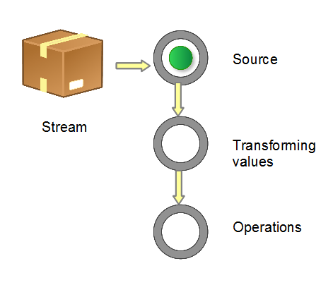

### Stream是什么
&emsp;Stream是Java 8中添加的一个新特性，它与`java.io`包里的`InputStream`和`OutputStream`是完全不同的概念。它借助于Lambda表达式，可以让你以一种声明的方式处理数据，可以极大提高Java程序员的生产力，让程序员写出高效率、干净、简洁的代码。

### Stream Demo
直接上Demo，感受一下
```java
List<String> myList = Array.asList("a", "b", "c", "d", "e");
myList.stream()
      .filter(s -> s.startsWith("1"))
      .map(String :: toUpperCase)
      .sorted()
      .foreach(System.out :: println)
```

### Stream如何工作
&emsp;当使用一个流的时候，通常包括三个基本步骤：
- 获取一个数据源（source）
- 数据转换
- 执行操作获取想要的结果

&emsp;每次转换原有Stream对象不改变，返回一个新的Stream对象（可以有多次转换），这就允许对其操作可以像链条一样排列，变成一个管道，如下图所示。
<div align=center>

</div>

在Stream中，分为两种操作：
- 中间操作
- 结束操作

&emsp;中间操作返回Stream，终端操作返回void或者非Stream结果。在demo中，`filter`、`map`、`sorted`都算是中间操作，而`foreach`是一个结束操作。

### Stream如何生成
&emsp;创建Stream的方式很多，最常见的是从`Collections`、`List`、和`Set`中生成
```java
List<String> myList = Arrays.asList("a1", "a2", "b1", "c2", "c1");
Stream<String> stream = myList.stream()
```
&emsp;在对象myList上调用方法`stream()`返回一个常规对象Stream。

&emsp;也可以从一堆已知对象中生成。
```java
Stream<String> stream = Stream.of("a1", "a2", "a3")
```
当然了，还有其它方式：
- Collection.stream()
- Collection.parallelStream()
- BufferedReader.lines()
- Files.walk()
- BitSet.stream()
- Random.ints()
- JarFile.stream()
- ……

### 常规操作
##### forEach
`forEach`方法接收一个Lambda表达式，用来迭代流中的每个数据
```java
Stream.of(1, 2, 3).forEach(System.out :: println)
// 1
// 2
// 3
```

##### map
`map`用于映射每个元素到对应的结果
```java
Stream.of(1, 2, 3).map( i -> i*i ).forEach(System.out :: println);
// 1
// 4
// 9
```

##### filter
`filter`用于通过设置的条件过滤出元素
```java
Stream.of(1, 2, 3).filter( i -> i == 1).forEach(System.out :: println);
// 1
```

##### limit
`limit`用于获取指定数量的流
```java
Stream.of(1, 2, 3, 4, 5).limit(2).forEach(System.out :: println)
// 1
// 2
```

#####  sorted
`sorted`用于对流进行排序
```java
Stream.of(4, 1, 5).sorted().forEach(System.out :: println);
// 1
// 4
// 5
```

##### Match
有三个match方法，从语义上说：
- `allMatch`：Stream中全部元素符合传入的predicate，返回true
- `anyMatch`：Stream中只要有一个元素符合传入的predicate，返回true
- `noneMatch`：Stream中没有一个元素符合传入的predicate，返回true

它们都不是要遍历全部元素才能返回结果。例如`allMatch`只要一个元素不满足条件，就skip剩下的所有元素，返回false。
```java
boolean result = Stream.of("a1", "a2", "a3").allMatch( i -> i.startsWith("a"));
System.out.println(result)
// true
```

##### reduce
`reduce`方法根据指定的函数将元素序列积累到某个值。此方法有两个参数：
- 起始值
- 累加器函数

如果有一个List，希望得到所有这些元素和一些初始值的总和。
```
int result = Stream.of(1, 2, 3).reduce(20, (a, b) -> a + b);
System.out.println(result)
// 26
```

##### collect
Collectors类中提供了功能丰富的工具方法
- `toList`
- `toSet`
- `toCollection`
- `toMap`
- ……

而这些方法，都需要通过`collect`方法传入。
```Java
Set<Integer> result = Stream.of(1, 1, 2, 3).collect(Collectors.toSet());
System.out.println(result);
// [1, 2, 3]
```
`collect`可以把Stream数据流转化为Collection对象。

### 骚技巧
##### for循环
&emsp;除了常规的对象Stream，还有一些有特殊类型的Stream，用于处理基本数据类型int、long和double，它是IntStream、LongStream和DoubleStream。

&emsp;比如可以使用`IntStream.range()`来代替常规的for循环。
```Java
IntStream.range(1, 4).forEach(System.out :: println);
```

##### 随机数
Random的ints方法可以返回一个随机数据流，比如返回1到100的10个随机数。
```Java
Random random = new Random();
random.ints(1, 100).limit(10).forEach(System.out :: println);
```

##### 大小写转化
```Java
List<String> output = wordList.stream()
  .map(String :: toUpperCase)
  .collect(Collectors.toList());
```

### 总结：Stream特点

- **无存储**

&emsp; Stream并不是一种数据结构，它只是某种数据源的一个视图

- **安全性**

&emsp;对Stream的任何修改都不会修改背后的数据源，比如对stream执行过滤操作并不会删除被过滤的元素，而是产生一个不包含被过滤元素的新Stream。

- **惰式执行**

&emsp;Stream上的操作并不会立即执行，只有等到用户真正需要结果的时候才会执行。

- **一次性**

&emsp;Stream只能被“消费”一次，一旦遍历过就会失效，就像容器的迭代器那样，想要再次遍历必须重新生成。

- **lambda**

&emsp;所有Stream的操作必须以lambda表达式为参数
