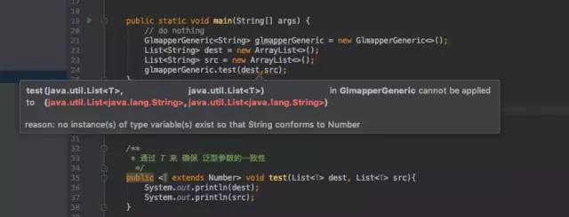

[原文来源](http://rrd.me/ekGHE)
### 前言
Java泛型（generics）是JDK5中引入的一个新特性，泛型提供了编译时类型安全监测机制，该机制允许开发者在编译时检测到非法的类型。

泛型的本质是参数化类型，也就是说所操作的数据类型被指定为一个参数。

### 泛型带来的好处
&emsp;在没有泛型的情况下，通过对类型Object的引用来实现参数的“任意化”，“任意化”带来的缺点是要做显式的强制类型转换，而这种转换是要求开发者对实际参数类型可以预知的情况下进行的。
对于强制类型转换错误的情况，编译器可能不提示错误，在运行的时候才出现异常，这是本身就是一个安全隐患。

&emsp;那么泛型的好处就是在编译的时候能够检查类型安全，并且**所有的强制转换都是自动和隐式的**。

```Java
public class GlmapperGeneric<T> {
    private T t;
    public void set(T t) { this.t = t; }
    public T get() { return t; }

    public static void main(String[] args) {
        // do nothing
    }

  /**
    *不指定类型
    */
    public void noSpecifyType(){
      GlmapperGeneric glmapperGeneric = new GlmapperGeneric();
      glmapperGeneric.set("test");
      // 需要强制类型转换
      String test = (String) glmapperGeneric.get();
      System.out.println(test);
    }

  /**
    *指定类型
    */
    public void SpecifyType(){
      GlmapperGeneric<String> glmapperGeneric.get();
      glmapperGeneric.set("test");
      // 不需要强制类型转换
      String test = glmapperGeneric.get();
      System.out.println(test);
    }
}
```
&emsp;上面这段代码中的specifyType方法中省去了强制转换，可以在编译的时候检查类型安全，可以用在类，方法，接口上。

### 泛型中通配符
&emsp;我们在定义泛型类，泛型方法，泛型接口的时候经常会碰见很多不同的通配符，比如T，E，K，V等等，这些通配符又都是什么意思呢？

#### 常用的T，E，K，V，?
&emsp;本质上这些嗾使通配符，没啥区别，只不过是编码时的一种约定俗成的东西。比如上述代码中的T，我们可以换成A-Z之间任何一个字母都可以，并不会影响程序的正常运行，但是如果换成其他的字母代替T，在可读性上可能会弱一些。
**通常情况下，T，E，K，V，?是这样约定的：**
- ? 表示不确定的java类型
- T（type）表示具体的一个java类型
- K V （key value）分别代表java键值中的Key Value
- E （element）代表Element

#### ? 无界通配符
下面先从一个小例子看起：

&emsp;我有一个父类Animal和几个子类，如狗、猫等，现在我需要一个动物的列表，我的第一个想法是像这样的：
```Java
List<Animal> listAnimals
```
但老板的想法却是这样的：
```Java
List<? extends Animal> listAnimals
```
&emsp;为什么要使用通配符而不是简单的泛型呢？通配符其实在声明局部变量时是没有什么意义的，但是当你为一个方法声明一个参数时，它是非常重要的。
```Java
static int countlegs (List<? extends Animal> animals) {
    int retVal = 0;
    for ( Animal animal : animals )
    {
        retVal += animal.countLegs();
    }
    return retVal;
}

static int countLegs1 (List<Animal> animals) {
    int retVal = 0;
    for ( Animal animal : animals )
    {
        retVal += animal.countLegs();
    }
    return retVal;
}

public static void main(String[] args){
    List<Dog> dogs = new ArrayList<>();
    // 不会报错
    countLegs(dogs);
    // 报错
    countLegs1(dogs);
}
```
&emsp;当调用countLegs1时，就会飘红，提示的错误信息如下：

<div align=center>

</div>

&emsp;所以，对于不确定或者不关心实际要操作的类型，可以使用无限制通配符（尖括号里一个问号，即<?>），表示可以持有任何类型。像countLegs方法中，限定了上界，但是不关心具体类型是什么，所以对于传入的Animal的所有子类都可以支持，并且不会报错。而countLegs1就不行。

### 上界通配符 < ? extends E >
> 上界：用extends关键字声明，表示参数化的类型可能是所指定的类型，或者是此类型的子类。

&emsp;在类型参数中使用extends表示这个泛型中的参数必须是E或者E的子类，这样有两个好处：
- 如果传入的类型不是 E 或者 E 的子类，编译不成功

- 泛型中可以使用 E 的方法，要不然还得强转成 E 才能使用

```Java
private <K extends A, E extends B> E test(K arg1, E arg2) {
    E result = arg2;
    arg2.compareTo(arg1);
    //.....
    return result;
}
```
> 类型参数列表中如果有多个类型参数上线，用逗号分开

### 下界通配符 < ? super E >
>下界：用super进行声明，表示参数化的类型可能是所指定的类型，或者是此类型的父类型，直至Object

在类型参数中使用super表示这个泛型中的参数必须是 E 或者 E 的父类。
```java
private <T> void test(List<? super T> dst, List<T> src) {
    for (T t : src) {
        dst.add(t);
    }
}

public static void main(String[] args) {
    List<Dog> dogs = new ArrayList<>();
    List<Animal> animals = new ArrayList<>();
    new Test3().test(animals, dogs);
}
// Dog 是 Animal 的子类
class Dog extends Animal {

}
```
&emsp;dst类型“大于等于”src的类型，这里的“大于等于”是指dst表示的范围比 src 要大，因此装得下 dst 的容器也就能装得下 src。

### ? 和 T 的区别
```Java
// 指定集合元素只能是 T 类型
List<T> list = new ArrayList<T>();
// 集合元素可以是任意类型，这种没有意义，一般是方法中，只是为了说明用法
List<?> list = new ArrayList<?>();
```

&emsp;? 和 T 都表示不确定的类型，区别在于我们可以对 T 进行操作，但是对 ? 不行，比如如下这种：

```Java
// 可以
T t = operate();

// 不可以
? car = operate();
```

简单总结下：

&emsp;T 是一个确定的类型，通常用于泛型类和泛型方法的定义，? 是一个不确定的类型，通常用于泛型方法的调用代码和形参，不能用于定义类和泛型方法。

#### 区别1：通过 T 来确保泛型参数的一致性
```java
// 通过 T 来确保泛型参数的一致性
public <T extends Number> void test(List<T> dest, List<T> src)

// 通配符是不确定的，所以这个方法不能保证两个 List 具有相同的元素类型
public void test(List<? extends Number> dest, List<? extends Number> src)
```

&emsp;像下面的代码中，约定的 T 是 Number 的子类才可以，但是申明时是用的 String，所以就会飘红报错。
<div align=center>

</div>

&emsp;不能保证两个 List 具有相同的元素类型的情况

```Java
GlmapperGeneric<String> glmapperGeneric = new GlmapperGeneric<>();
List<String> dest = new ArrayList<>();
List<Number> src = new ArrayList<>();
glmapperGeneric.testNon(dest, src);
```

&emsp;上面的代码在编译器不会报错，但是当进入到testNon方法内部操作时（比如赋值），对于 dest 和 src 而言，就还是需要进行类型转换。

### 区别2：类型参数可以多重限定而通配符不行
```Java
public class MultiLimit implements MultiLimitInterfaceA, MultiLimitInterfaceB {
    /**
      * 使用 "&" 符号设定多重边界 (Multi Bounds)
      * @param t
      * @param <T>
      */
      public static <T extends MultiLimitInterfaceA & MultiLimitInterfaceB> void test(T t) {

      }
}

/**
  * 接口 A
  */
interface MultiLimitInterfaceA { }
/**
 * 接口B
 */
interface MultiLimitInterfaceB { }
```
使用 & 符号设定多重边界（Multi Bounds），指定泛型类型 T 必须是
MultiLimitInterfaceA 和 MultiLimitInterfaceB 的共有子类型，此时变量 t 就具有了所有限定的方法和属性。对于通配符来说，因为它不是一个确定的类型，所以不能进行多重限定。

### 区别3：通配符可以使用超类限定而类型参数不行
类型参数 T 只具有一种类型限定方式：
```Java
T extends A
```
但是通配符 ? 可以进行两种限定：
```Java
? extends A
? super A
```

### Class<T> 和 Class<?> 区别
&emsp;前面介绍了 ? 和 T 的区别，那么对于 `Class<T>` 和 `Class<?>` 又有什么区别呢？

&emsp;`Class <T>` 和 `Class <?>` 最常见的是在反射场景下的使用，这里以用一段发射的代码来说明下。
```Java
// 通过反射的方式生成 MultiLimit 对象，这里比较明显的是，我们需要使用强制类型转换
MultiLimit multiLimit = (MultiLimit)
Class.forName("com.glmapper.bridge.boot.generic.MultiLimit").newInstance();
```
对上述代码，在运行期，如果反射的类型不是 MultiLimit 类，那么一定会报 `java.lang.ClassCastException` 错误。

&emsp;对于这种情况，则可以使用下面的代码来代替，使得在编译期就能直接检查到类型的问题：

```Java
public class Test3 {
    public static <T> T createInstance(Class<T> clazz) throws IllegalAccessException, InstantiationException {
        return clazz.newInstance();
    }

    public static void main(String[] args) throws IllegalAccessException, InstantiationException {
        A a = createInstance(A.class);
        B b = createInstance(B.calss);
    }
}

class A { }

class B { }
```
&emsp;`Class <T>` 在实例化的时候，T 要替换成具体类。`Class <?>`它是个通配泛型，? 可以代表任何类型，所以主要用于声明时的限制情况。比如，我们可以这样做申明：
```Java
// 可以
public Class<?> clazz;

// 不可以，因为 T 需要指定类型
public Class<T> clazzT;
```
&emsp;所以当不知道声明什么类型的 Class 的时候可以已定义一个 Class。
```Java
public class Test3 {
    public Class<?> clazz;
    public Class<T> clazzT;
}
```
&emsp;那如果也想 `public Class<T> calzzT;`这样的话，就必须让当前的类也指定 T
```Java
public class Test3<T> {
    public Class<?> clazz;
    // 不会报错
    public Class<T> clazzT;
}
```
