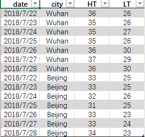

`pandas.pivot_table()`

参数列表：

参数|说明
:-:|:-
`data`|DataFrame对象
`values`|源数据中的一列，数据透视表中用于观察分析的数据值，类似Excel中的值字段
`index`|源数据中的一列，数据透视表用于行索引的数据值，类似Excel中的行字段
`column`|源数据中的一列，数据透视表用于列索引的数据值，类似Excele中的列字段
`aggfunc`|根据当前的行、列索引生成的数据透视表中有多少个数据需要进行聚合时，对这多个数据需要进行的操作，默认为`np.mean()`
`fill_value`|用于替换结果表中的缺失值
`dropna`|boolean，默认为True
`margins_name`|String，默认为“ALL”，当参数`margins`为True时，ALL行和列的名字

#### 示例数据集
&emsp;下面的Excel表格分别记录了武汉和北京一周（2018/07/22 - 2018/07/28）的日最高温度和日最低温度，对数据进行以下的分析：
- 武汉、北京一周的日最高、最低气温趋势变化
- 两城市一周的平均日最高、最低气温变化趋势

<div align=center>

</div>
- HT : the highest temperature，日最高气温
- LT : THE lowest temperature，日最低气温

#### 创建DataFrame对象
读取excel文件：`pd.read_excel()`
```python
import pandas as pd
df = pd.read_excel("Temperature.xlsx")
print(df)

date     city  HT  LT
0   20180722    Wuhan  36  26
1   20180723    Wuhan  35  26
2   20180724    Wuhan  35  27
3   20180725    Wuhan  35  26
4   20180726    Wuhan  36  30
5   20180727    Wuhan  37  29
6   20180728    Wuhan  36  30
7   20180722  Beijing  33  25
8   20180723  Beijing  33  25
9   20180724  Beijing  32  26
10  20180725  Beijing  31  25
11  20180726  Beijing  33  23
12  20180727  Beijing  33  24
13  20180728  Beijing  34  23
```

#### 分别分析日最高、最低温度
`pd.pivot_table()`，也可以用作method，`DataFrame.pivot_table()`

```python
print(pd.pivot_table(df,values='HT', index='city', columns='date'))

date     20180722  20180723  20180724  20180725  20180726  20180727  20180728
city
Beijing        33        33        32        31        33        33        34
Wuhan          36        35        35        35        36        37        36
```

```python
print(df.pivot_table(values = 'LT', index = 'city', columns='date'))

date     20180722  20180723  20180724  20180725  20180726  20180727  20180728
city
Beijing        25        25        26        25        23        24        23
Wuhan          26        26        27        26        30        29        30
```

#### 分析日平均最高、最低温度
```python
print(df.pivot_table(values='HT', columns='date', aggfunc=np.mean))

date  20180722  20180723  20180724  20180725  20180726  20180727  20180728
HT        34.5      34.0      33.5      33.0      34.5      35.0      35.0
```
```python
print(df.pivot_table(values=['HT', 'LT'], columns = 'date', aggfunc=np.mean))

date  20180722  20180723  20180724  20180725  20180726  20180727  20180728
HT        34.5      34.0      33.5      33.0      34.5      35.0      35.0
LT        25.5      25.5      26.5      25.5      26.5      26.5      26.5
```
