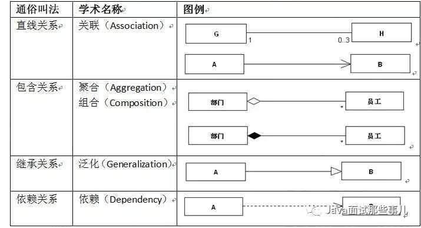
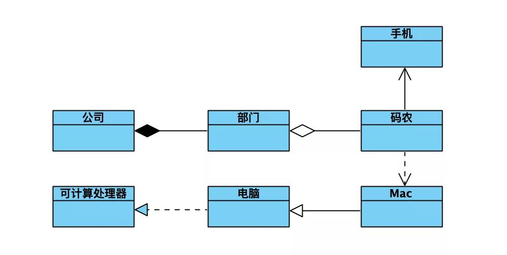
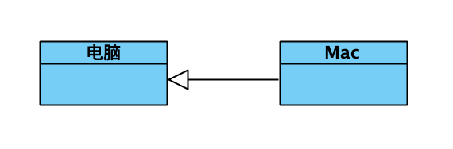
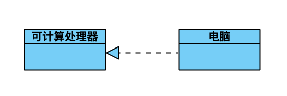
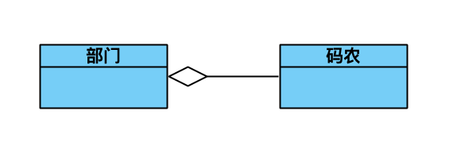
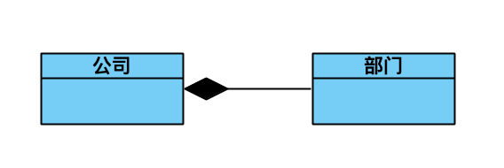
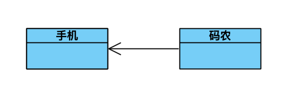
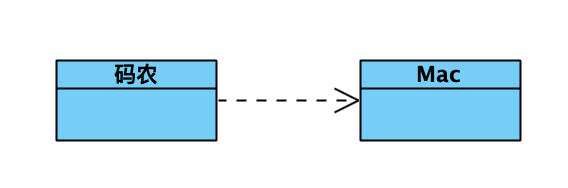

>本文转自：码匠笔记

 
&emsp;在团队协作过程中最常见的就是开会、开会最常用的就是图，而图中最常见的就是：
- 流程图
- 时序图
- 类图

&emsp;这三个图可以清楚的描述你想解释的内容。

 

&emsp;上图是模拟出来的一个场景和大家具体说一下类图究竟该怎么画才对。图中讲的是这样一个「故事」：
> 一个公司下面有很多部门，公司和部门是不可分割的。码农属于一个部门，但是如果部门解散了，码农依然是码农。码农无时无刻不在用手机，只有工作时间才会使用Mac。Mac是一种电脑，电脑是“可计算处理器”的一种实现。下面我们就逐一介绍下这些关系。

<table><tr><td bgcolor=PeachPuff height=30px width=200px>

泛化关系(generation)

</td></tr></table>

&emsp;泛化关系为is-a的关系；两个对象之间如果可以用is-a来表示，就是泛化关系。

 
&emsp;泛化关系用一条带空心箭头的直接表示。如图为例，Mac和电脑就是泛化关系，通常在程序里面泛化表现为继承于非抽象类。（**可以理解成电脑是一个类，Mac是一个电脑类的具体化对象**）

<table><tr><td bgcolor=PeachPuff height=30px width=200px>

实现关系(realization)

</td></tr></table>

 
&emsp;实现关系用一条带实心箭头的虚线表示。如图为例，电脑和可计算处理器就是实现关系，通常程序里面的实现关系表现为继承抽象类。
比如我们平时写的Readable、Printable等接口的实现。

<table><tr><td bgcolor=PeachPuff height=30px width=200px>

聚合关系(aggregation)

</td></tr></table>

 
&emsp;聚合关系用一条带空心菱形箭头的直线表示，如图码农和部门就是聚合关系。与组合关系不同的是，整体和部分不是强依赖的，即使整体不存在了，部分仍然存在。如图为例，部门撤销了，码农换一个工作还是码农嘛。

<table><tr><td bgcolor=PeachPuff height=30px width=200px>

组合关系(composition)

</td></tr></table>

 
&emsp;组合关系用一条带实心菱形箭头直线表示，与聚合关系一样，组合关系同样表示整体由部分构成的关系，不同之处在于整体和部分是强依赖关系，如果整体不存在了，部分也不复存在。如图为例，如果公司倒闭了，那么何来部门呢？

<table><tr><td bgcolor=PeachPuff height=30px width=180px>

关联关系(association)

</td></tr></table>

 
&emsp;关联关系通常用一条直线表示，当然如果需要标明方向可以添加箭头。它是描述不同的类对象之间的关系，通常不会随着状态的变化而变化，可以理解为被关联者属于关联者的一部分。如图为例，手机就是码农的一部分，不会因为他上班与否而变化所属关系。通常情况在程序里面类似变量的方式表现。

<table><tr><td bgcolor=PeachPuff height=30px width=200px>

依赖关系(dependency)

</td></tr></table>

 
&emsp;依赖关系是用一套带箭头的虚线表示，他通常描述一个对象在运行期间会用到另一个对象的关系。如图为例码农只有在工作的时候才会用到Mac电脑，所以这种依赖关系时依赖于运行状态的。通常情况下是在程序里面通过构造函数、形参等体现。
