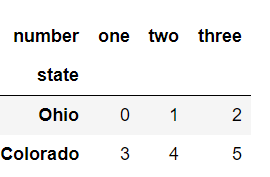
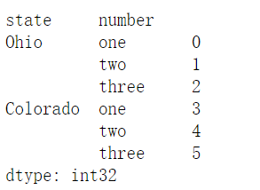
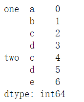
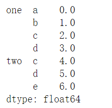

首先，要知道以下五点：
1. `stack` : 将数据的列“旋转”为行
2. `unstack` : 将数据的行“旋转”为列
3. `stack`和`unstack`默认操作为最内层
4. `stack`和`unstack`默认旋转轴的级别将会成果结果中的最低级别（最内层）
5. `stack`和`unstack`为一组逆运算操作

**例1：创建DataFrame，行索引名为state，列索引名为number**
```python
import pandas as pd
import numpy as np
data = pd.DataFrame(np.arange(6).reshape((2, 3)), index = pd.Index(['Ohio','Colorado'], name = 'state'),
                columns = pd.Index(['one','two','three'], name = 'number'))
print(data)
```
<div align=center>

</div>
</br>

**例2：将DataFrame的列旋转为行，即stack操作。**
```python
result = data.stack()
print(result)
```
<div align=center>

</div>
</br>

&emsp;stack操作后将列索引number旋转为行索引，并且置于行索引的最内层（外层为索引state），也就是将旋转轴（number）的结果置于最低级别。

**例3：将DataFrame的行旋转为列，即unstack操作。**
```python
result.unstack()
```
<div align=center>

</div>
</br>
&emsp;第三点的意思是，unstack操作默认将内层索引number旋转为列索引。

&emsp;同时，也可以指定分层级别或者索引名称来指定操作级别，下面做法同样会得到上面的结果。

```python
result.unstack(1)
```
<div align=center>

</div>
</br>
```python
result.unstack('number')
```
<div align=center>

</div>
</br>

**例4：stack和unstack逆运算**
```python
s1 = pd.Series([0,1,2,3], index=list('abcd'))
s2 = pd.Series([4,5,6], index=list('cde'))
data2 = pd.concat([s1,s2], keys=['one','two'])
print(data2)
```
<div align=center>

</div>
</br>

```python
data2.unstack().stack()
```
<div align=center>

</div>
</br>
