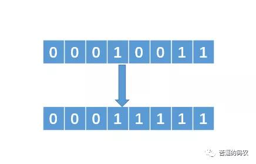

### 1、判断奇偶数

&emsp;判断一个数是奇数还是偶数，相信很多人都做过，一般的做法的代码如下：
```java
if(n % 2 == 01){
  // n是个奇数
}
```

&emsp;如果把n以二进制的形式展示的话，其实我们只需要判断最后一个二进制位是1还是0就行了，如果是1的话，代表是奇数；如果是0则代表是偶数，所以采用位运算的方式的话，代码如下：
```java
if(n & 1 == 1){
  // n是个奇数
}
```

### 2、交换两个数

&emsp;例如，交换x与y值，传统代码如下：
```java
int tmp = x;
x = y;
y = temp;
```
&emsp;如果不允许你使用额外的辅助变量来完成交换呢？这时候，位运算大法就来了，代码如下：
```java
x = x ^ y   // (1)
y = x ^ y   // (2)
x = x ^ y   // (3)
```
&emsp;我们知道，两个相同的数**异或**之后结果会等于0，即 n ^ n = 0。并且任何数与0异或等于它本身，即 n ^ 0 = n。所以，解释如下：

把（1）中的x代入（2）中的x，有：

y = x ^ y = (x ^ y) ^ y = x ^ (y ^ y) = x ^ 0 = x。 x的值成功赋给了y

对于（3），推导如下：
x = x ^ y = (x ^ y) ^ x = (x ^ x) ^ y = 0 ^ y = y

>这里解释一下，异或运算支持运算的交换律和结合律哦。

### 3、找出没有重复的数
> 给你一组整型数据，在这些数据中，其中有一个数只出现了一次，其他的数都出现了两次，让你找出这个数。

&emsp;这道题可能很多人会用一个哈希表来存储，每次存储的时候，记录某个数出现的次数，最后再遍历哈希表，看看哪个数只出现了一次。这种方法的时间复杂度为O(n)，空间复杂度也为O(n)了。

&emsp;我们刚才说过，两个相同的数异或的结果是0，一个数和0异或的结果是它本身，所以我们把这一组整型全部异或一下，例如这组数据是：1, 2, 3, 4, 5, 1, 2, 3, 4.其中5只出现了一次，其他都出现了两次，把他们全部异或一下，结果如下：

&emsp;由于异或支持交换律和结合律，所以：
```
1 ^ 2 ^ 3 ^ 4 ^ 5 ^ 1 ^ 2 ^ 3 ^ 4

= (1 ^ 1) ^ (2 ^ 2) ^ (3 ^ 3) ^ (4 ^ 4) ^ 5

= 0 ^ 0 ^ 0 ^ 0 ^ 5 = 5
```
&emsp;也就是说，那些出现了两次的数异或之后会变成0，那个出现一次的数，和0异或之后就等于它本身。所以代码如下：
```java
int find(int[] arr){
  int tmp = arr[0];
  for (int i = 1; i <= arr.length; i++){
      tmp = tmp ^ arr[i];
  }
  return tmp;
}
```

### 4、2的n次方
&emsp;如果让你求解2的n次方，并且不能使用系统自带的pow函数，你会怎么做呢？传统的做法是连续让n个2相乘，代码如下：
```java
int pow(int n){
  int tmp = 1;
  for (int i = 1; i <= n; i++){
      tmp = tmp * 2;
  }
  return tmp;
}
```
&emsp;但这样做的时间复杂度为O(n)，如果用位运算来做，你会怎么做呢？

&emsp;举个例子，例如 n = 13，则n的二进制表示为1101，那么2的13次方可以拆解为：

&emsp;`2 ^ 1101 = 2 ^ 0001 * 2 ^ 0100 * 2 ^ 1000`

&emsp;我们可以通过 `& 1` 和 `>> 1` 来逐位读取1101，为1时将该位代表的乘数累乘到最终结果。代码如下：
```java
int pow(int n){
    int sum = 1;
    int tmep = 2;
    while(n != 0){
        if(n & 1 == 1){
            sum *= tmp;
        }
    }
    return sum;
}
```
&emsp;时间复杂度近为O(logn)。
> 位运算很多情况下都是和二进制扯上关系的，所以我们要判断是否适合位运算，很多情况下都会把它们拆分成二进制，然后观察特性，或者就是利用与、或、异或的特性来观察。

### 5、找出不大于N的最大的2的幂指数
&emsp;传统的做法就是让1不断乘以2，代码如下：
```java
int findN(int N){
    int sum = 1;
    while(true){
        if(sum * 2 > N){
            return sum;
        }
        sum = sum * 2;
    }
}
```
&emsp;这样做的话，时间复杂度是O(logn)，如果要弄成位运算的方式，该怎么做呢？

&emsp;例如 N = 19，那么转换成二进制就是 00010011（这里为了方便，我采用8位的二进制来表示）。那么我们要找的数就是，把二进制中**最左边的1保留，后面的1全部变为0**。即我们的目标数是00010000，那么如何获得这个数呢？相应解法如下：

1. 找到最左边的1，然后把它右边的所有0变成1
<div align=center>

</div>
<br/>

2. 把得到的数值加1，可以得到 00100000 即 00011111 + 1 = 00100000。

3. 把得到的00100000向右移动一位，即可得到00010000，即 00100000 >> 1 = 00010000。

&emsp;问题在于，第一步中把最左边1中后面的0转化为1该怎么弄呢？代码如下：
```java
n |= n >> 1;
n |= n >> 2;
n |= n >> 4;
```
&emsp;通过把n右移并且做或运算即可得到。

&emsp;我们假设最左边的1处于二进制位中的第k位（从左往右数），那么把n右移一位之后，那么得到的结果中第k+1位也必定为1，然后把n与有以后的结果做或运算，那么得到的结果中第k和第 k+1 位必定是 1；

&emsp;同理，再次把n右移两位，那么得到的结果中第 k+2 和第 k+3 位必定是 1，然后再次做或运算，那么就能得到第 k，k+1，k+2，k+3都是1，如此往复下去。

最终代码如下：
```java
int findN(int n){
    n |= n >> 1;
    n |= n >> 2;
    n |= n >> 4;
    n |= n >> 8;    //整型一般是32位，上面假设是8位。
    return (n + 1) >> 1;
}
```
&emsp;这种做法的时间复杂度近似O(1)。
